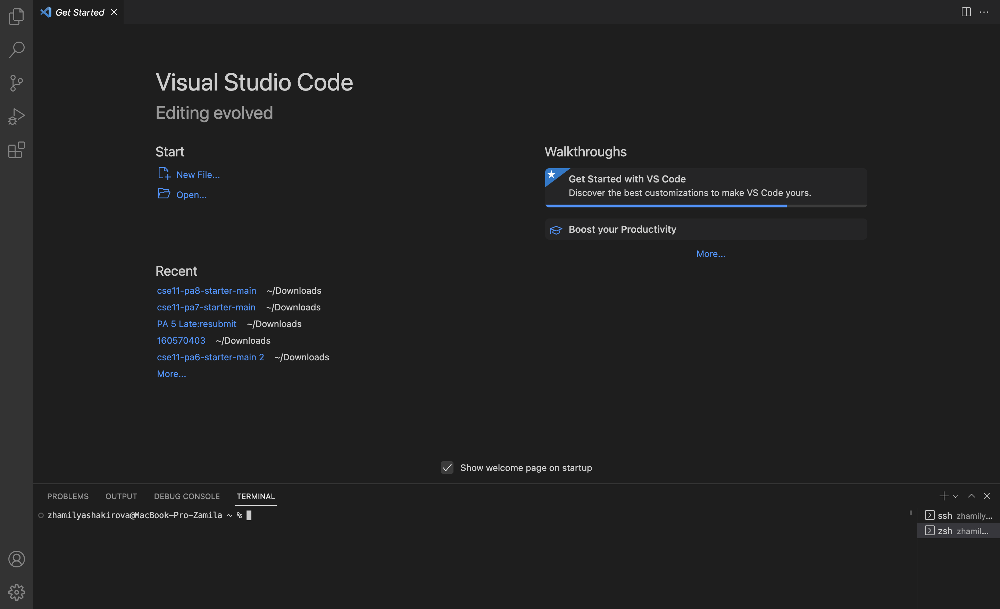
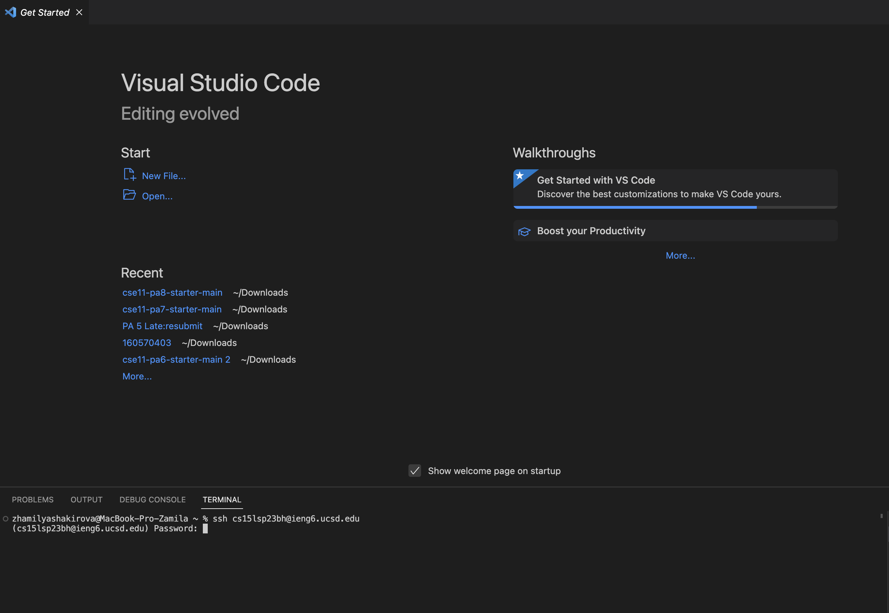
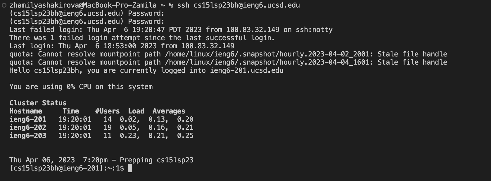

https://ucsd-cse15l-s23.github.io/week/week1/#part-1--meet-your-group 
a tutorial for incoming 15L students about how to log into a course-specific account on ieng6. 
1 the steps you took, along with screenshots of what each step looked like
2 For each step include 2-3 sentences or bullet points describing what you did
3 you didn’t do the step exactly, describe why not (maybe your computer already had something on it, maybe the department computers worked differently, etc).

Remotely Connecting
Trying Some Commands
       Lab 1 report Zhamilya Shakirova
1) First step that I had to take was to install Visual Studio code. However, during the last quarter I was enrolled in CSE 8B and already had installed the app in the beggining of Winter quarter. The only thing I have to do now is to open VS code and new terminal.

2)  The second step is remotely connecting. I entered "ssh cs15lsp23zz@ieng6.ucsd.edu" in the terminal. However, you ned to change "zz" to the unique letters that are attached to your account. Since it wasn't my first time it printed "(cs15lsp23zz@ieng6.ucsd.edu) Password:". But when it's your first time the computer will print "The authenticity of host 'ieng6.ucsd.edu (128.54.70.227)' can't be established. RSA key fingerprint is SHA256:ksruYwhnYH+sySHnHAtLUHngrPEyZTDl/1x99wUQcec. Are you sure you want to continue connecting (yes/no/[fingerprint])? ". You should answer yes.
  

You enter the password and then terminal prints this:

3) The third step is to try some of the commands. I tried command "ls -lat". The result looked should look like this:

Remotely Connecting!
Trying Some Commands
