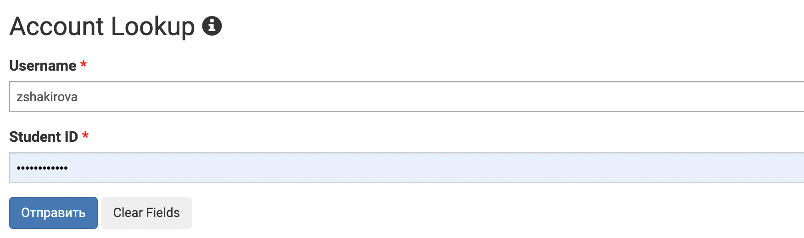
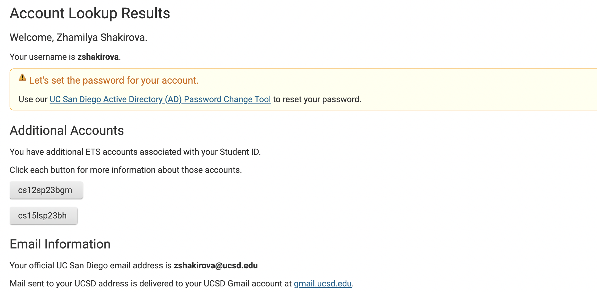
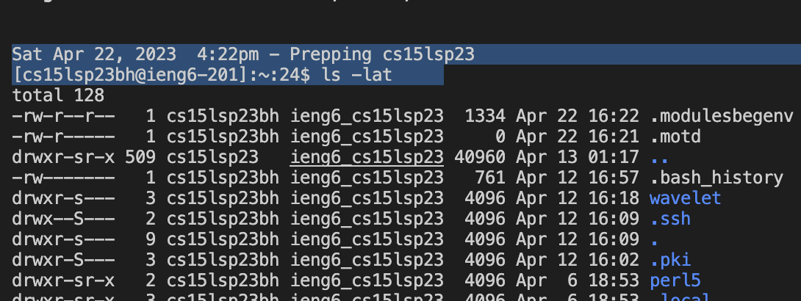
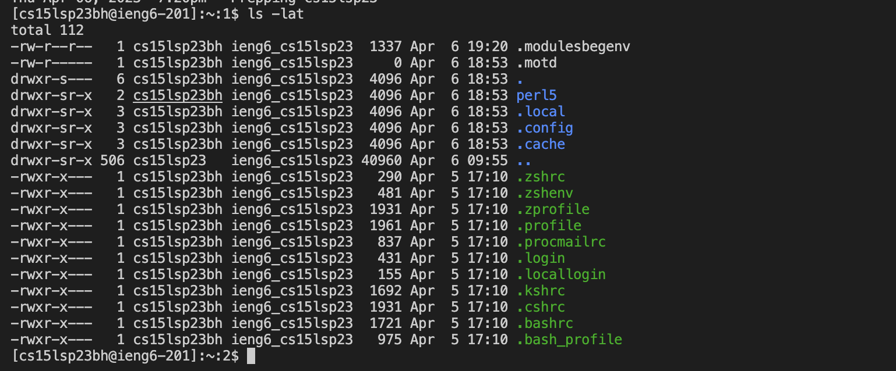
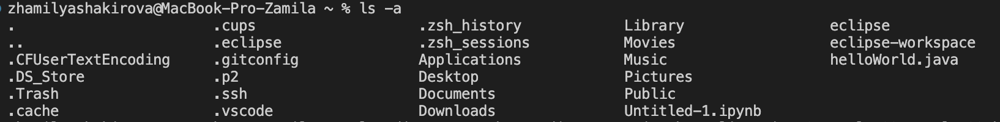

      Lab report 1 Zhamilya Shakirova

1. First step that I had to take was to install Visual Studio code. However, during the last quarter I was enrolled in CSE 8B and had already installed the app in the beggining of Winter quarter. The only thing I have to do now is to open VS code and new terminal. However if you don't have VS code installed you can visit this website: https://code.visualstudio.com. Follow the instructions and you'll be able to dowmload the app. Also there are different versions for macOS and Windows. 

2. The second step is remotely connecting. Before this step, you need to access your account and reset the password. To access your CSE15L account, go to the website https://sdacs.ucsd.edu/~icc/index.php and search for your course-specific account. If you need help resetting your password, you can refer to a tutorial that explains the steps to do so. Here is the link to the tutorial: https://drive.google.com/file/d/17IDZn8Qq7Q0RkYMxdiIR0o6HJ3B5YqSW/view?usp=share_link.
3. In VS code you enter your unique code that loooks like this:"ssh cs15lsp23zz@ieng6.ucsd.edu" in the terminal. However, you ned to change "zz" to the unique letters that are attached to your account. To find it you need to go to this website: https://sdacs.ucsd.edu/~icc/index.php, enter your account name, PID. There you'll see "cs15lsp23zz".

5.  Since it wasn't my first time it printed "(cs15lsp23zz@ieng6.ucsd.edu) Password:". But when it's your first time remotely connecting, the computer will print "The authenticity of host 'ieng6.ucsd.edu (128.54.70.227)' can't be established. RSA key fingerprint is SHA256:ksruYwhnYH+sySHnHAtLUHngrPEyZTDl/1x99wUQcec. Are you sure you want to continue connecting (yes/no/[fingerprint])? ". You should answer yes.
  

You enter the password and then terminal prints this:

3. The third step is to try some of the commands. I tried command "ls -lat". The result looked should look like this:

The command "ls -lat" shows a list of files and folders in the current location, with additional information and sorted by the latest changes made. The most recently modified files or folders will be displayed first. You can also try other commands!

ls -a
The command "ls -a" shows a list of all files and folders in the current location, including the ones that are hidden and not displayed by default. Hidden files and folders have names that start with a dot (.) symbol.
cd ~
By typing "cd ~" in the terminal or command prompt, you can move to the home directory of the current user. This is the default directory that opens up when you start a new terminal or command prompt session.
cd
The command "cd" with no argument changes the current working directory to the home directory of the current user. As a result, you will be redirected to the default directory where you begin when you launch a new terminal or command prompt session.
ls -lat
ls <directory> where <directory> is /home/linux/ieng6/cs15lsp23/cs15lsp23abc, where the abc is one of the other group members’ username
cp /home/linux/ieng6/cs15lsp23/public/hello.txt ~/
cat /home/linux/ieng6/cs15lsp23/public/hello.txt

Well done! Now, you knoiw how to use VS code, remotely connect, and use commands!
