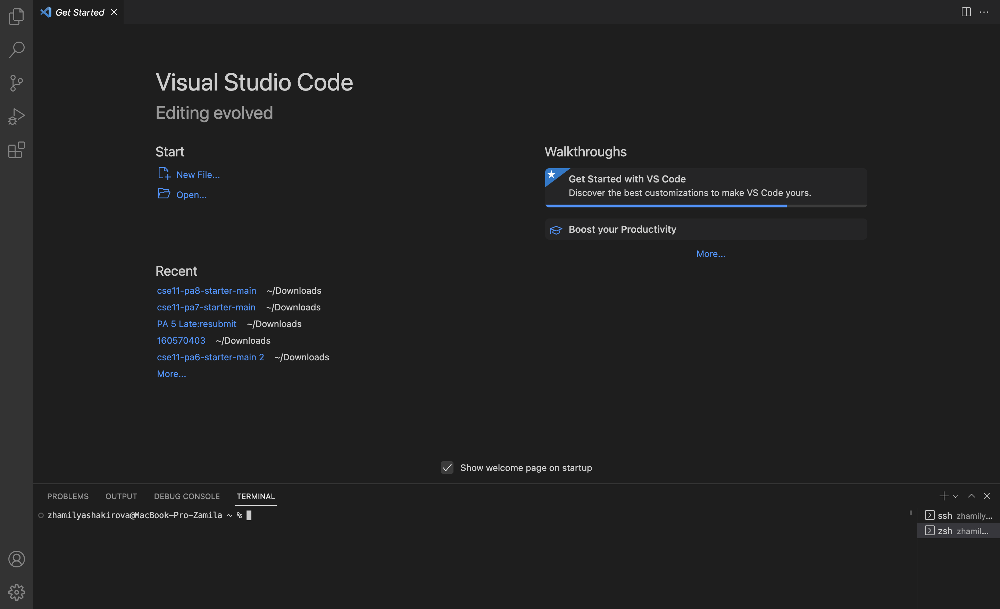

https://ucsd-cse15l-s23.github.io/week/week1/#part-1--meet-your-group 
a tutorial for incoming 15L students about how to log into a course-specific account on ieng6. 
1) the steps you took, along with screenshots of what each step looked like
2) For each step include 2-3 sentences or bullet points describing what you did
3) you didn’t do the step exactly, describe why not (maybe your computer already had something on it, maybe the department computers worked differently, etc).
Installing VScode
Remotely Connecting
Trying Some Commands
       Lab 1 report Zhamilya Shakirova
1) First step that I had to take was to install Visual Studio code. However, during the last quarter I was enrolled in CSE 8B and already installed it in the beggining of Winter quarter. The only thing I need to do is to open VS code and new terminal.

Remotely Connecting!
Trying Some Commands
