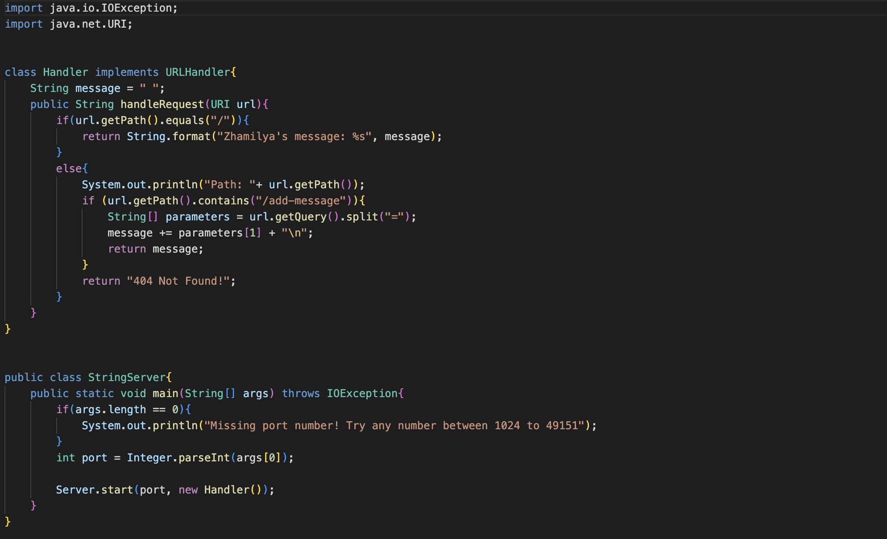
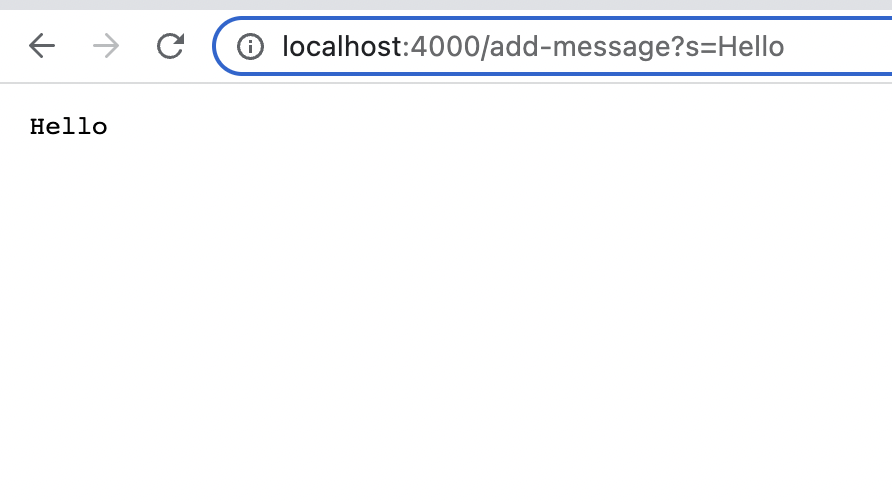
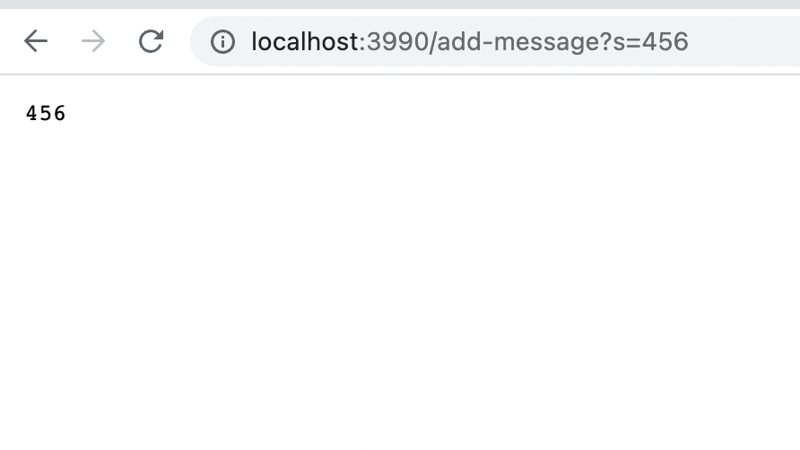

This is lab 2

Here is the code for StringServer.java
import java.io.IOException;
import java.net.URI;

class Handler implements URLHandler{
    String message = " ";
    public String handleRequest(URI url){
        if(url.getPath().equals("/")){
            return String.format("Zhamilya's message: %s", message);
        }
        else{
            System.out.println("Path: "+ url.getPath());
            if (url.getPath().contains("/add-message")){
                String[] parameters = url.getQuery().split("=");
                message += parameters[1] + "\n";
                return message;
            }
            return "404 Not Found!";
        }
    }
}

public class StringServer{
    public static void main(String[] args) throws IOException{
        if(args.length == 0){
            System.out.println("Missing port number! Try any number between 1024 to 49151");
        }
        int port = Integer.parseInt(args[0]);

        Server.start(port, new Handler());
    }
}
