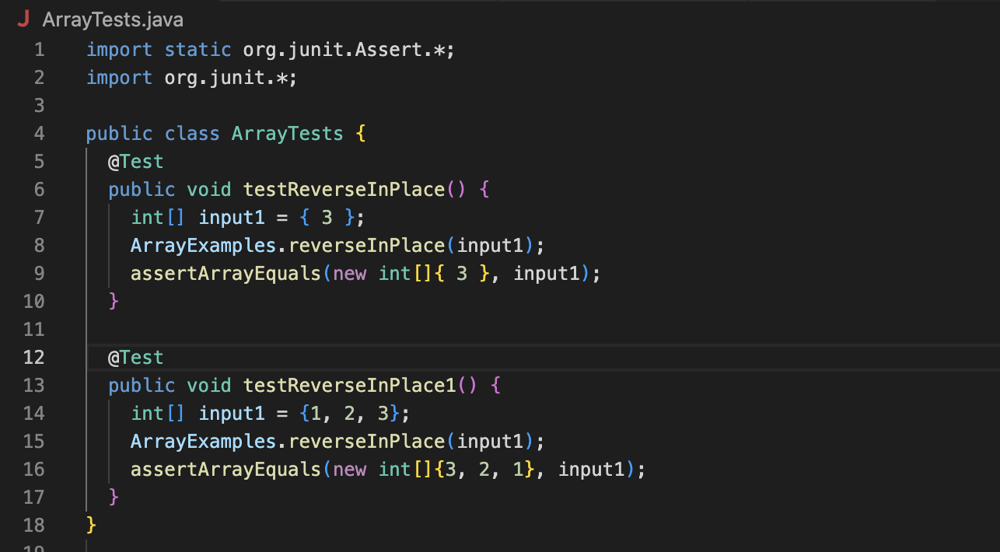

Lab 2
Part 1
Here is the code for StringServer.java

The first example of using /add-message

Following methods are called:
- main method of the `StringServer` class
- start method of the `Server` class
- handleRequest method of the `Handler` class

When I entered the URL "localhost/add-message?s=Hello" in the browser, the handleRequest method of the "Handler" class was called with the URI object representing the URL entered as its argument.

In this method, the "getPath" method of the "url" object is called to retrieve the path of the URL. Since the path is "/add-message", the code inside the "if" block is executed. The "getQuery" method of the url object is then called to retrieve the query string of the URL. In this case, the query string is "Hello".

The split method is then called on the query string to separate the parameter name and value. Since the query string only contains one parameter, the parameters array will contain element "Hello".

The message field of the Handler class is then updated by concatenating the value of the "s" parameter to it, followed by a newline character.

The new value of the message field is then returned by the method and displayed in the browser. Therefore, the value of the message field is changed as a result of this specific request.

The second example of using /add-message
 When you make a specific request, the handleRequest method in the code is called with a URL as an argument. The method checks the URL's path and executes the code inside the "if" block when the path is "/add-message". The method then uses the getQuery method to get the query string from the URL, which is "s=456". It splits the query string into two parts using "=" as a separator, and then it concatenates the value of the "s" parameter to the message field of the Handler class followed by a newline character.

Therefore, the value of the message field changes from an empty string to " 456\n". Finally, the new value of the message field is returned and displayed in the browser, which means that the message field changed because of this specific request

Part 2
Here is the intital code of the method that has a bug in it:

I've written 2 tests. One will pass, the other one won't

Here is the terminal screenshot that one of the tests failed

On this picture, I showed one of the possible options to change method's code so it'll work correctly for each of the test cases

The bug of the code was in the for loop. The i went untill the last element in the array. At first, it reversed elements, but then reversed again so the array remained the same. The first test case worked because there is only one element and even if you reverse the order, it will remain at i=0.

Part 3:
From Lab 2 I learned how to build and run your own server. I saw how program that I write can become a server. Also I learned that I can change the output of the localhost directly in the URL handler. For example, in Lab 3 I used "add-message=.." and server printed me any String I would write in the URL Handler.

