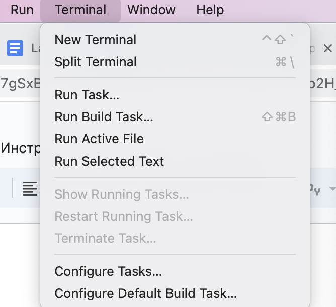
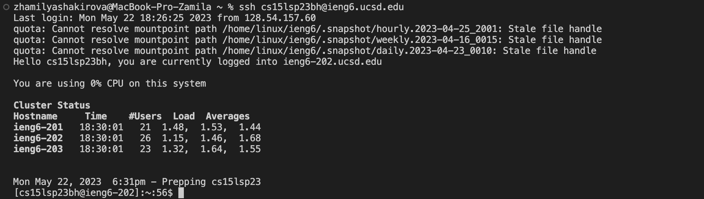
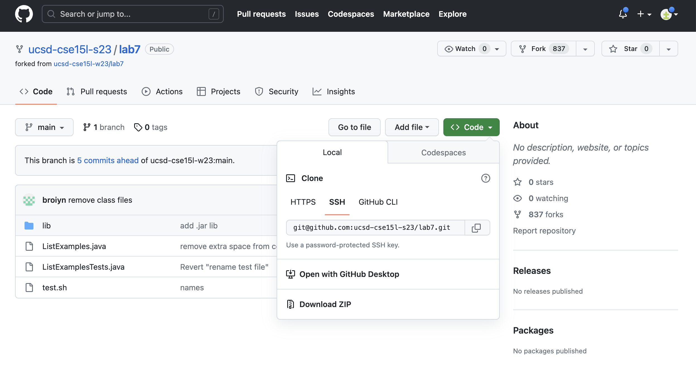
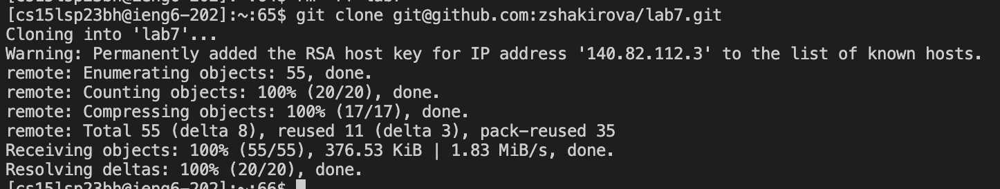
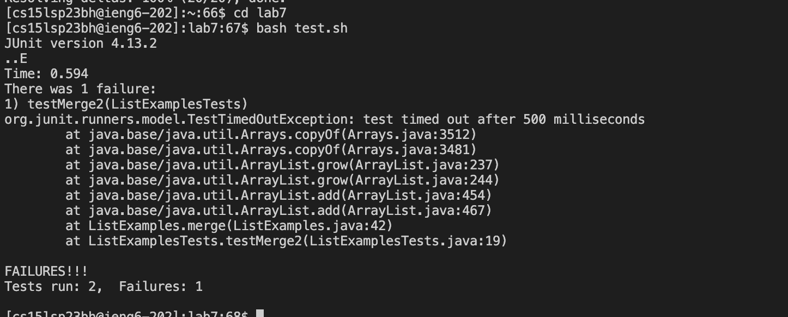
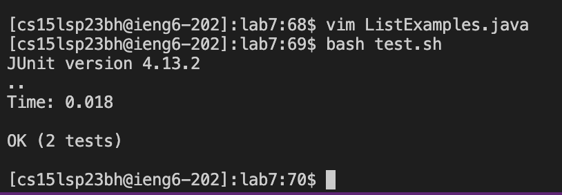
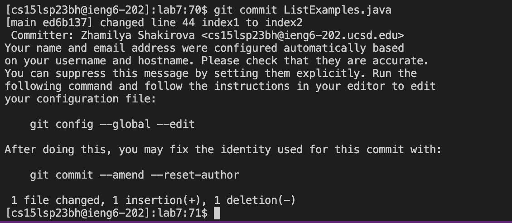
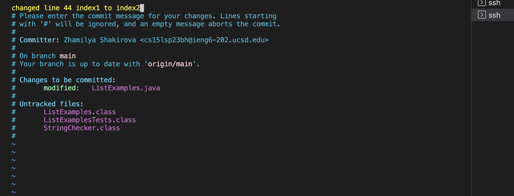
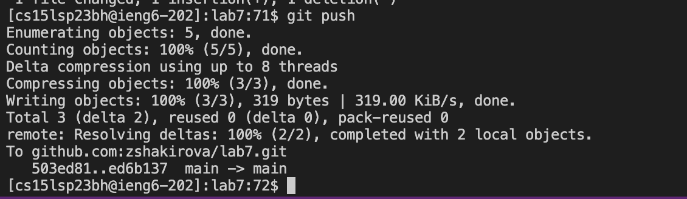
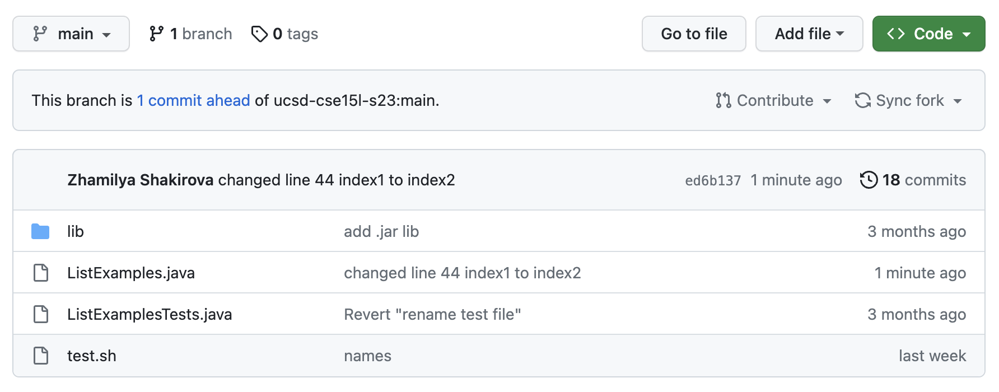

Step 4:
Log into ieng6

  Open the VS code and new terminal. 
  
  
  
  
  
  
  
  Then we need to log in. Keys pressed: `ssh<space>cs15lsp23zz@ieng6.ucsd.edu<enter>`, where zz is unique numbers you can find in your github         profile 
  
 
  
Summary: The user logs into the ieng6 server using SSH and their specific username. The process involves opening Visual Studio Code (VS Code) and a new terminal.

Step 5: 
Clone your fork of the repository from your Github account

 In the github when you open your repository, you press `code` and then press `SSH`. You'll see the link that you need to copy and paste in the       terminal. 
 
 
  After this we need to clone the repository. Keys pressed in terminal: `git<space>clone<space>git@github.com:zshakirova/lab7.git<enter>`

 

Summary:  Clone your fork of the repository from your Github account
The user navigates to their GitHub repository, selects the SSH option, and copies the repository link. They then use the terminal to clone their repository by running the "git clone" command followed by the copied link.

Step 6:
Run the tests, demonstrating that they fail

To do this you need to go inside the lab7 and then run tests.
 Keys pressed: `cd<space>lab7<enter>`
`bash<space>test.sh<enter>`

 

Summary: Run the tests, demonstrating that they fail
The user changes the directory to the cloned repository and executes a test script ("test.sh") by running the "bash" command followed by "test.sh". The purpose is to showcase that the tests currently fail.

Step 7:
Edit the code file to fix the failing test

Keys pressed: `vim<space>ListExamples.java<enter>`
  
  
  `/change<enter>jllxi2<escape>:wq<enter>`
Summary: Edit the code file to fix the failing test
Using the text editor Vim, the user opens the "ListExamples.java" file. They make necessary changes to address the failing test(s), specifically modifying "index1" to "index2". They save and exit the editor.

Step 8:
Run the tests, demonstrating that they now succeed

Keys pressed: `bash<space>test.sh<enter>`

Summary: 
Run the tests, demonstrating that they now succeed
The user runs the test script ("test.sh") again using the "bash" command. This time, the tests should pass to demonstrate the successful fix made in the previous step.

Step 9:
Commit and push the resulting change to your Github account (you can pick any commit message!)
Keys pressed: `git<space>commit<space>ListExamples.java<enter>`

I typed `changed<space>line<space>44<space>index1<space>to<space>index2<enter>` 
then to exit and save the commit press `:wq<enter>`

To push resulting change I pressed `git<space>push<enter>`

Here is the screenshot of my repository that shows the change was successful, it states `Zhamilya Shakirova changed the line index1 to index2`:

Summary: Commit and push the resulting change to your Github account
The user performs a Git commit of the modified "ListExamples.java" file with a commit message. They then push the commit to their GitHub repository using the "git push" command. A screenshot is provided as evidence of the successful change in the repository.

Each step contributes to the process of logging in, cloning a repository, running and fixing tests, and finally committing and pushing the changes to GitHub.
