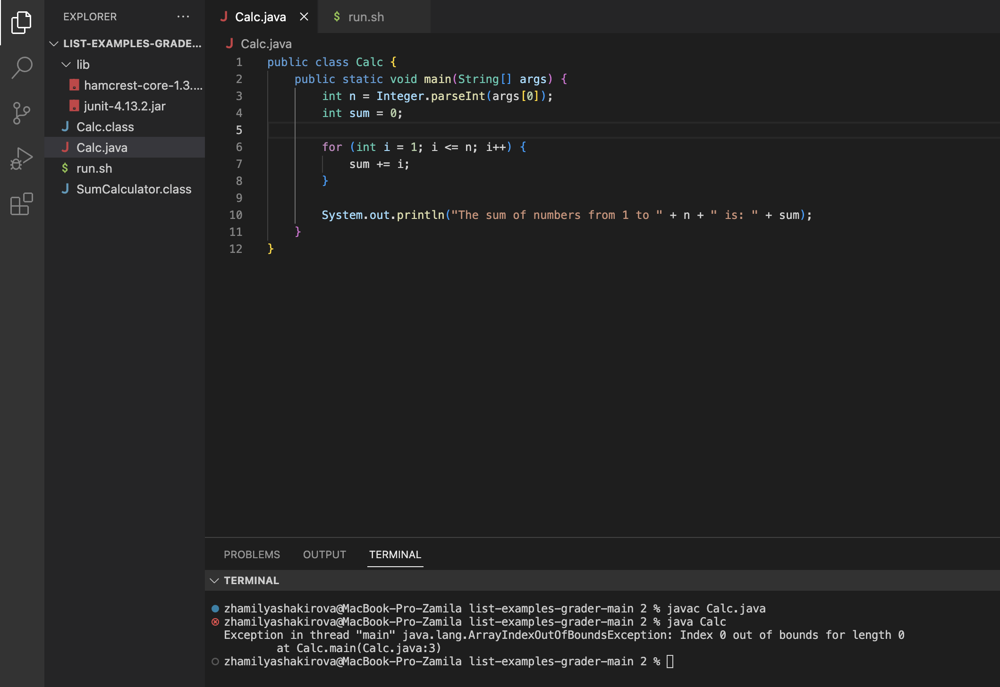
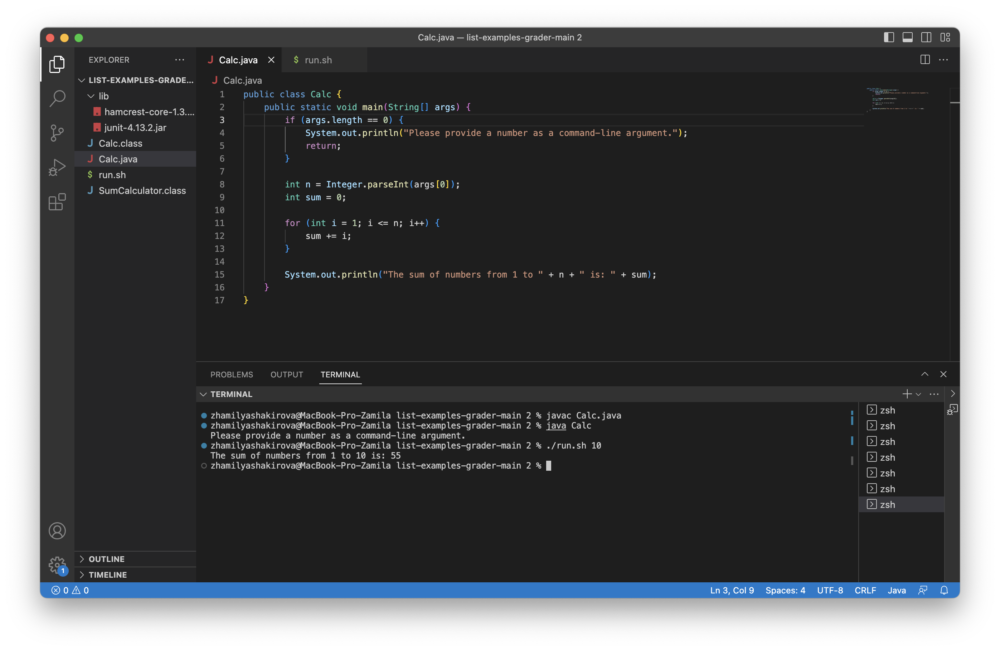
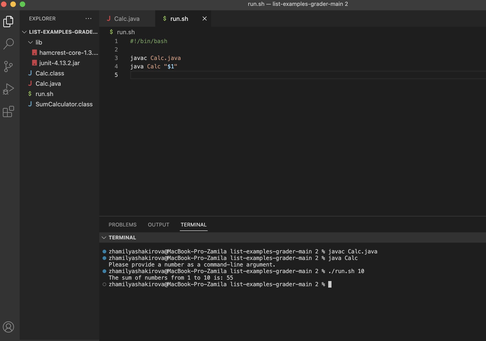

Part 1 – Debugging Scenario

Part 2 – Reflection
In a couple of sentences, describe something you learned from your lab experience in the second half of this quarter that you didn’t know before. It could be a technical topic we addressed specifically, something cool you found out on your own building on labs, something you learned from a tutor or classmate, and so on. It doesn’t have to be specifically related to a lab writeup, we just want to hear about cool things you learned!

Post

*What environment are you using (computer, operating system, web browser, terminal/editor, and so on)?*

I'm using Mac computer, VS code

*Detail the symptom you're seeing. Be specific; include both what you're seeing and what you expected to see instead. Screenshots are great, copy-pasted terminal output is also great. Avoid saying “it doesn't work”.*

When I try to run my program, the terminal prints: "Exception in thread "main" java.lang.ArrayIndexOutOfBoundsException: Index 0 out of bounds for length 0
 at Calc.main(Calc.java:8)"

*Detail the failure-inducing input and context. That might mean any or all of the command you're running, a test case, command-line arguments, working directory, even the last few commands you ran. Do your best to provide as much context as you can.*

I just tried running, there were no other commands in the terminal before I wrote javac Calc.java<enter> java Calc

Responce of TA: 

The bug in this code arises beacuse you didn't provide a command-line argument for n. This leads to an ArrayIndexOutOfBoundsException since you are trying to access the first element of the args array without checking its length.
To fix the bug, you need to validate the command-line arguments and provide a proper error message if no argument is provided.

Code and terminal after change:

 

Bash file:

